# Mini Training Center Course Catalog MVC — Lab04

Ứng dụng ASP.NET Core MVC quản lý danh mục khóa học cho một trung tâm đào tạo nhỏ. Project được phát triển tiếp từ Lab03 và nâng cấp theo yêu cầu **Lab04**: xây dựng **Data Layer** rõ ràng với EF Core, dùng **database thật (SQLite)**, áp dụng **Dependency Injection**, **Service/Repository Pattern**, **Options Pattern**, **Migration/Seed Data** và nghiệp vụ nhiều bước có **Transaction (Commit/Rollback)**.

> Nhánh thực hiện Lab04: `lab04-mini-course`

## Chủ Đề

**Mini Training Center** — Hệ thống quản lý nội bộ trung tâm đào tạo: xem danh sách khóa học, xem chi tiết và quan hệ dữ liệu, thống kê doanh thu/sĩ số, và **đăng ký khóa học** (giảm số chỗ trống trong một transaction an toàn).

## Công Nghệ Sử Dụng

- ASP.NET Core MVC (.NET 10)
- Entity Framework Core 10 + SQLite
- Dependency Injection, Options Pattern
- Repository Pattern, Service Layer
- xUnit (Unit Test với Fake Repository)
- Razor View Engine, Bootstrap 5, Chart.js

## Kiến Trúc & Luồng Xử Lý

Ứng dụng tuân theo luồng tách tầng rõ ràng:

```text
Controller → Service → Repository → DbContext → Database (SQLite)
```

- **Controller** chỉ nhận request và gọi Service, không query database trực tiếp.
- **Service** chứa logic nghiệp vụ, map dữ liệu sang ViewModel.
- **Repository** chịu trách nhiệm truy vấn EF Core.
- **DbContext** (`AppDbContext`) quản lý phiên làm việc với database.

## Cấu Trúc Thư Mục (Data Layer)

```text
MiniCourseCatalog.Mvc
├── Controllers/          # CoursesController, CourseCategoriesController, EnrollmentsController, DataHealthController, HomeController
├── Data/
│   └── AppDbContext.cs   # DbSet, Fluent API mapping, Seed Data
├── Models/               # Course, CourseCategory, Student, Enrollment
├── Repositories/
│   ├── Interfaces/       # ICourseRepository, IEnrollmentRepository, ...
│   └── *.cs              # Implementation
├── Services/
│   ├── Interfaces/       # ICourseService, IEnrollmentService, ...
│   └── *.cs              # Nghiệp vụ
├── Options/
│   └── TrainingCenterConfig.cs   # Cấu hình strongly-typed (Options Pattern)
├── ViewModels/
├── Migrations/           # InitialCreate, SeedInitialData, AddMoreStudents, AddCourseConcurrencyToken
└── Views/

MiniCourseCatalog.Tests/  # Project unit test (xUnit + Fake Repository)
```

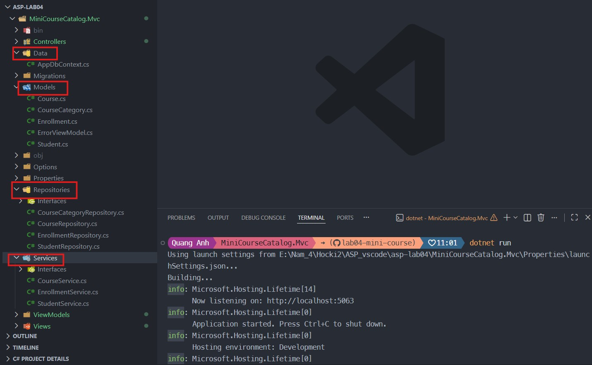

## Mô Hình Dữ Liệu & Quan Hệ

Ứng dụng có **1 `AppDbContext`**, **4 Entity** và **3 Relationship**:

| Quan hệ | Loại | Ý nghĩa |
|---|---|---|
| `CourseCategory` → `Course` | One-to-Many | Một chuyên ngành có nhiều khóa học |
| `Course` → `Enrollment` | One-to-Many | Một khóa học có nhiều lượt đăng ký |
| `Student` → `Enrollment` | One-to-Many | Một học viên có nhiều lượt đăng ký |

`Enrollment` là bảng trung gian thể hiện quan hệ Many-to-Many giữa `Course` và `Student`.

## Các Yêu Cầu Lab04 Đã Thực Hiện

### Dependency Injection & Lifetime

Đăng ký trong `Program.cs` với lifetime phù hợp:

- `AppDbContext`: **Scoped** (mặc định của `AddDbContext`) — mỗi request một instance.
- Repository & Service: **Scoped** — cùng request chia sẻ chung `DbContext`, đảm bảo nhất quán transaction.

### Options Pattern

`TrainingCenterConfig` (gồm `LowSeatThreshold`, `CenterName`) được bind từ `appsettings.json` và inject qua `IOptions<TrainingCenterConfig>`. Service đọc ngưỡng cảnh báo từ đây thay vì hard-code, nên đổi cấu hình không cần sửa code nghiệp vụ.

### Migration, Update Database & Seed Data

- Các migration có tên rõ nghĩa: `InitialCreate`, `SeedInitialData`, `AddMoreStudents`, `AddCourseConcurrencyToken`.
- Seed Data bằng `HasData`: 4 chuyên ngành, 4 khóa học, 15 học viên — đủ để kiểm tra danh sách, relationship và transaction.

### Tracking & AsNoTracking

- **AsNoTracking** cho truy vấn chỉ đọc (danh sách, chi tiết, tìm kiếm, lịch sử) — nhẹ và nhanh hơn.
- **Tracking** cho nghiệp vụ cập nhật (đăng ký khóa học) để EF Core tự sinh `UPDATE` khi giảm số chỗ.

### Transaction (Commit/Rollback)

Nghiệp vụ **đăng ký khóa học** (`EnrollmentService.EnrollStudentAsync`) bọc nhiều bước ghi trong một transaction: kiểm tra khóa học/học viên/còn chỗ/chưa trùng → thêm `Enrollment` + giảm số chỗ → `Commit`. Nếu bất kỳ bước nào lỗi → `Rollback` toàn bộ, không bao giờ rơi vào trạng thái nửa đúng nửa sai.

## Kết Quả Chạy Ứng Dụng

| Trang | Route | Mô tả |
|---|---|---|
| Trang chủ | `/` | Giới thiệu hệ thống |
| Danh sách khóa học | `/Courses` | Lấy dữ liệu thật từ database (AsNoTracking) |
| Chi tiết | `/Courses/Detail/{id}` | Hiển thị quan hệ khóa học – chuyên ngành |
| Chuyên ngành | `/CourseCategories` | Quan hệ One-to-Many |
| Đăng ký | `/Courses/Enroll` | Nghiệp vụ Transaction |
| Thống kê | `/Courses/Stats` | Doanh thu, sĩ số, biểu đồ Chart.js |
| Tìm kiếm | `/Courses/Search` | Lọc theo từ khóa và chuyên ngành |
| Data Health | `/DataHealth` | Kiểm tra migration, seed, tracking, transaction |

### Danh sách khóa học (dữ liệu thật từ database)

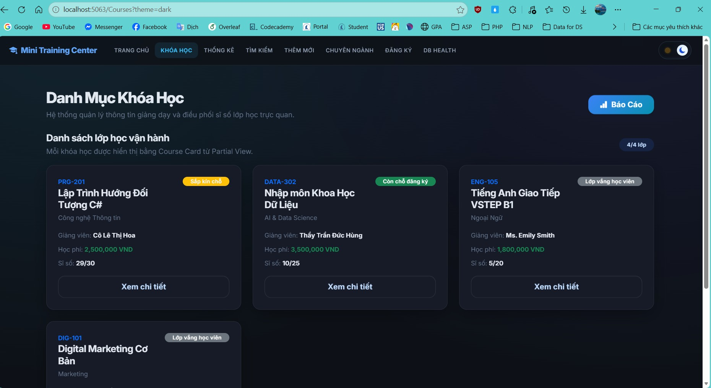

### Quan hệ One-to-Many (Chuyên ngành – Khóa học)

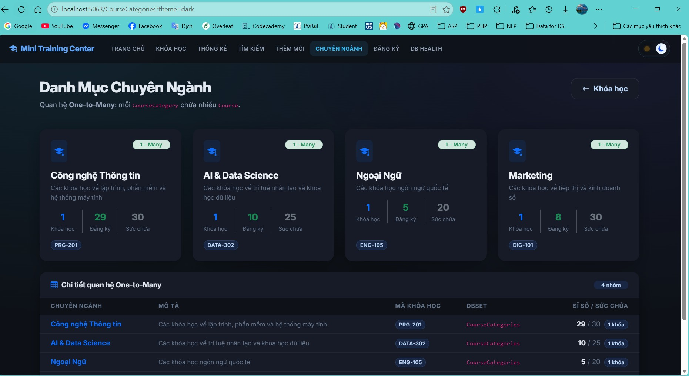

### Transaction đăng ký — Commit thành công

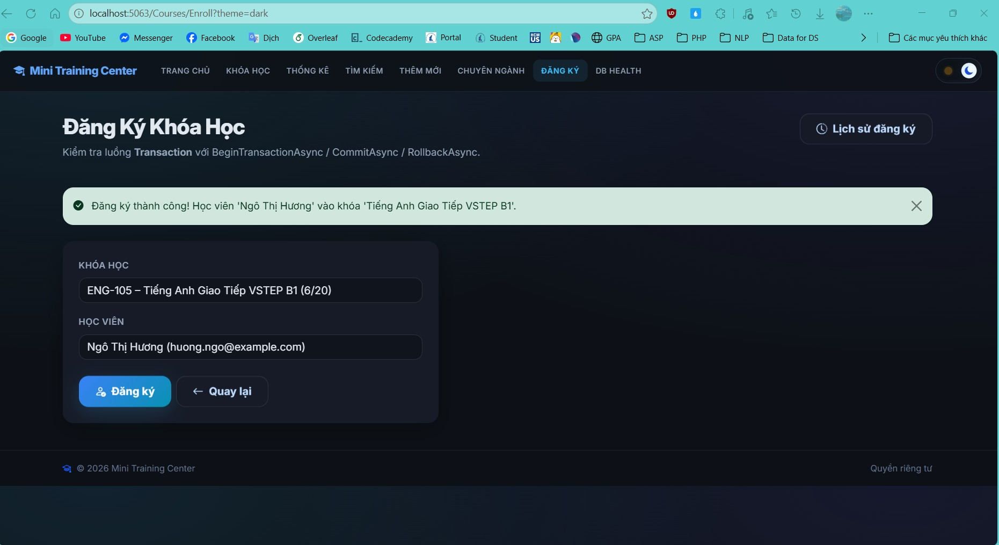

### Transaction đăng ký — Rollback khi lớp đã đầy

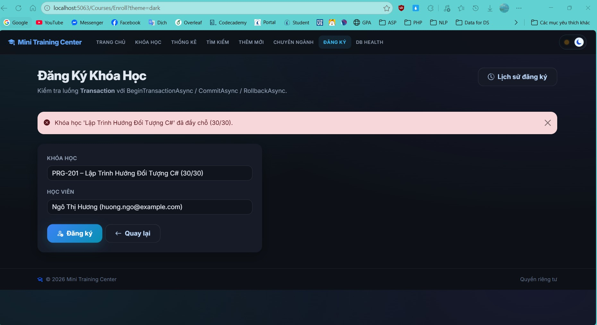

### Trang Data Health

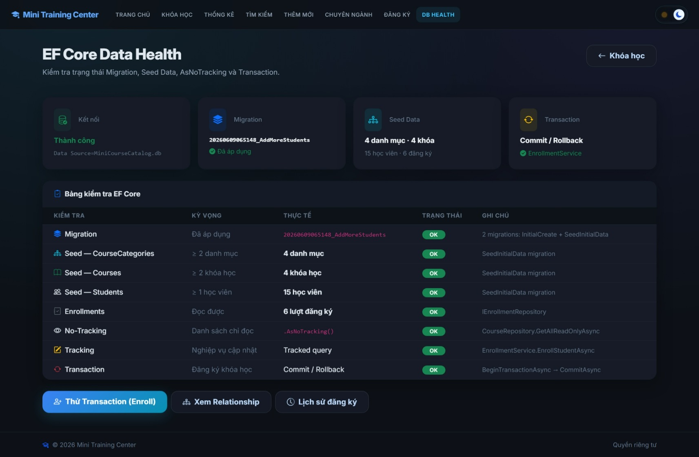

## Tính Năng Mở Rộng (Làm Thêm)

### 1. Unit Test thật với xUnit + Fake Repository

Project `MiniCourseCatalog.Tests` với các Fake Repository (`FakeCourseRepository`, `ThrowingEnrollmentRepository`) chứng minh kiến trúc đã tách dependency. 11 test theo Arrange–Act–Assert kiểm chứng: doanh thu/tỷ lệ lấp đầy, ngưỡng Options, đăng ký thành công, lớp đầy bị từ chối, đăng ký trùng, và **Rollback khi lỗi giữa transaction**.

```powershell
dotnet test
```

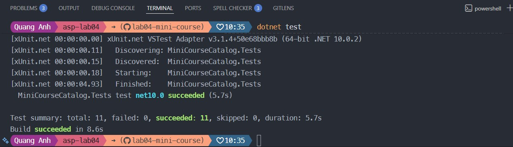

### 2. Validate Options khi khởi động (ValidateOnStart)

`TrainingCenterConfig` được gắn `[Range(1,100)]`, `[Required]` và đăng ký `ValidateDataAnnotations().ValidateOnStart()`. Cấu hình sai (ví dụ `LowSeatThreshold = -5`) khiến app **từ chối khởi động** thay vì chạy sai âm thầm.

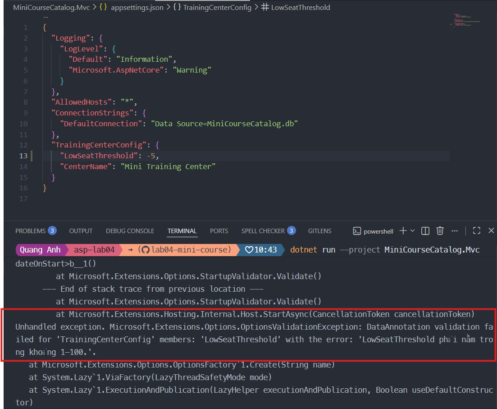

### 3. Concurrency Token chống bán vượt số chỗ (oversell)

Thêm cột `Version` vào `Course` với `IsConcurrencyToken()` + migration `AddCourseConcurrencyToken`. Khi hai người tranh chỗ cuối cùng, request commit sau nhận `DbUpdateConcurrencyException` và bị Rollback, đảm bảo không vượt số chỗ tối đa.

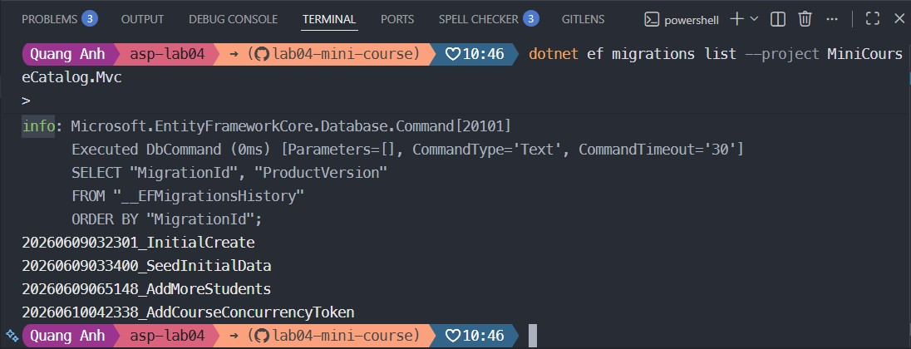

### 4. Biểu đồ thống kê bằng Chart.js

Trang `/Courses/Stats` có biểu đồ cột doanh thu theo chuyên ngành và biểu đồ tròn tỷ lệ lấp đầy, kèm count-up. Dữ liệu đi đúng luồng `Service → ViewModel → View`.

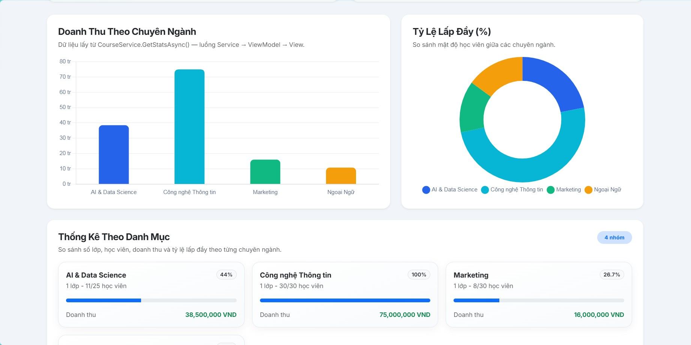

### 5. Hiện đại hóa giao diện

Course Card với dải màu theo chuyên ngành, thanh tiến trình sĩ số đổi màu theo mức lấp đầy, price tag học phí; toast thông báo theo mô hình PRG; navbar có dropdown quản trị; design tokens cho theme sáng/tối.

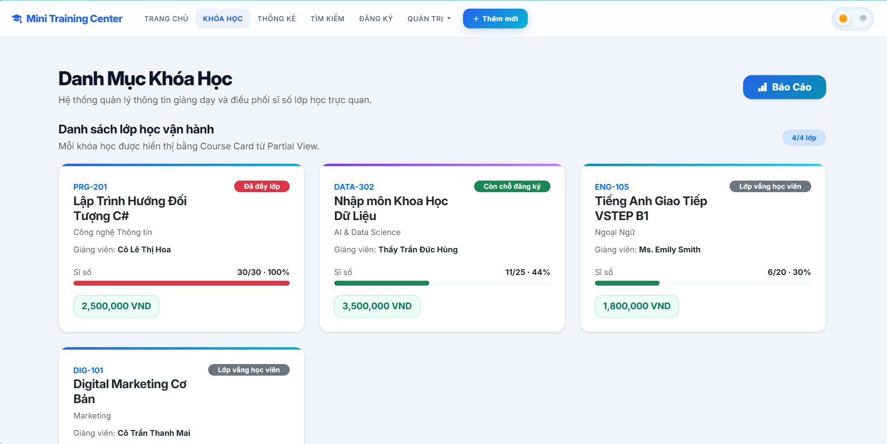

## Hướng Dẫn Chạy Project

```powershell
# 1. Khôi phục & cập nhật database
dotnet ef database update --project MiniCourseCatalog.Mvc

# 2. Chạy ứng dụng
dotnet run --project MiniCourseCatalog.Mvc

# 3. Chạy unit test
dotnet test
```

Sau đó mở URL hiển thị trong terminal (ví dụ `http://localhost:5063`).

## Ghi Chú

- Dữ liệu được lưu trong database SQLite (`MiniCourseCatalog.db`), không còn mất khi tắt ứng dụng như Lab03.
- Toàn bộ nghiệp vụ ghi dữ liệu nhiều bước đều được bọc trong transaction để đảm bảo toàn vẹn.
- Nếu trình duyệt chưa cập nhật CSS/HTML mới, nhấn `Ctrl + F5` để refresh mạnh.
